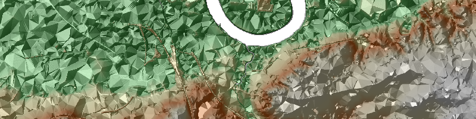
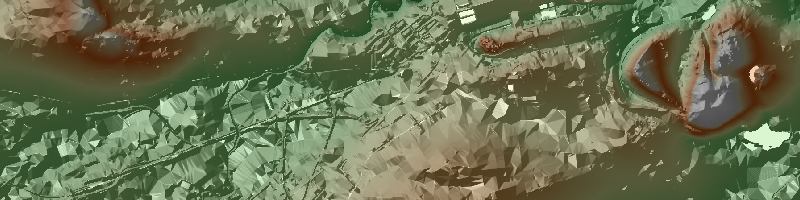

alpinia!
========

comically exaggerated relief maps made easy

<a href="https://github.com/kevinstadler/alpinia/raw/master/gallery/londinium.png"></a>

dependencies
------------

the python bindings for [mapnik](http://mapnik.org) (as well as for [gdal](http://gdal.org) if you also want the script to generate hillshades on the fly)

<a href="https://github.com/kevinstadler/alpinia/raw/master/gallery/sevenhills.png"></a>

examples
--------

    # london x 400
    ./alpinia.py -x gallery/londinium.xml --hillshade 400 --center 51.51 -0.06 --scale 35000 gallery/londinium.png

    ./alpinia.py -x gallery/londinium.xml --hillshade 400 --size 800 200 --center 51.48 -0.02 --scale 50000 gallery/londinium-small.png

    ./alpinia.py -x gallery/londinium.xml --hillshade 400 --size 800 200 --center 51.49 -0.06 --scale 170000 gallery/londinium-wide.png


    # edinburgh x 500
    ./alpinia.py -x gallery/sevenhills.xml --hillshade 500 --scale 20000 --center 55.938 -3.225 gallery/sevenhills.png

    ./alpinia.py -x gallery/sevenhills.xml --size 800 200 --hillshade 500 --scale 40000 --center 55.943 -3.215 gallery/sevenhills-small.png

usage
-----

``` bash
./alpinia.py --help
```

    ## usage: alpinia.py [-h] [--xml XML] [--size SIZE SIZE] [--center CENTER CENTER]
    ##                   [--scale SCALE] [--hillshade [HILLSHADE]]
    ##                   [output]
    ## 
    ## alpinia! comically exaggerated relief maps made easy
    ## 
    ## positional arguments:
    ##   output                output filename (default: alpinia.png)
    ## 
    ## optional arguments:
    ##   -h, --help            show this help message and exit
    ##   --xml XML, -x XML     mapnik style file (default: alpinia.xml)
    ##   --size SIZE SIZE      output width and height in pixels. if one of them is
    ##                         0, the other will be chosen so that the aspect of the
    ##                         map matches that of the input data file (default:
    ##                         [1920, 1080])
    ##   --center CENTER CENTER
    ##                         desired map center (latitude and longitude in degrees)
    ##   --scale SCALE         desired map scale
    ##   --hillshade [HILLSHADE], -z [HILLSHADE]
    ##                         (re-)generate hillshading. input and output filename
    ##                         are extracted from the xml file's 'relief' and
    ##                         'hillshade' layers respectively. optionally, specify
    ##                         the z exaggeration to use for the hillshading
    ##                         (default: 1.0)

<!--
# merging OS terrain data
gdal_merge.py -o city.tif *.asc
# rescaling
gdalwarp -overwrite -ts 4000 0 orig.tif city.tif
# generate hillshade using [gdaldem](http://www.gdal.org/gdaldem.html)
gdaldem hillshade -combined -z 10 city.tif hillshade.tif
-->
links
-----

-   [south up!](https://github.com/kevinstadler/southup)
-   <http://blog.mastermaps.com/2012/06/creating-color-relief-and-slope-shading.html>
-   <http://www.reliefshading.com/design/>
